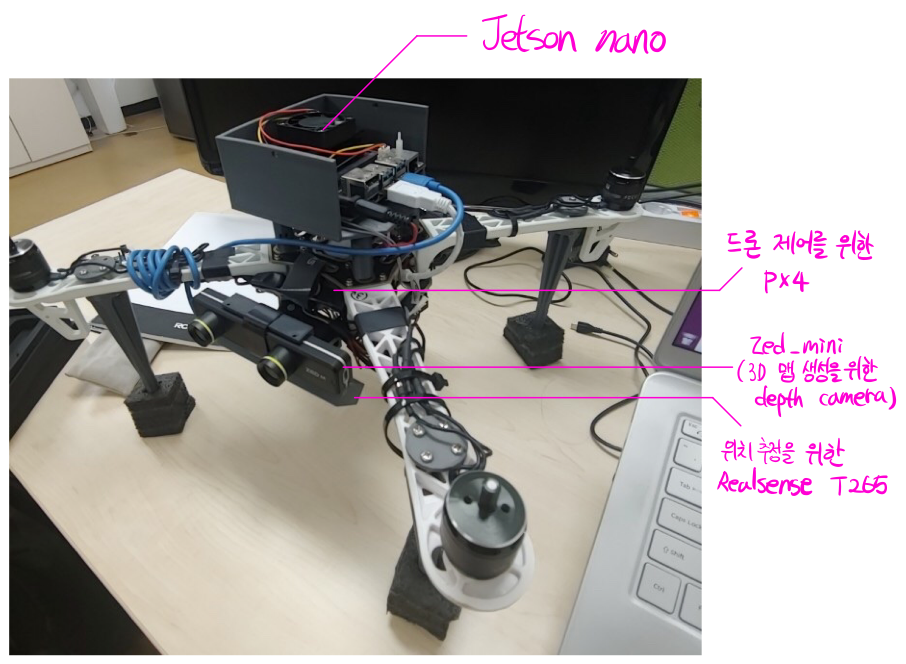
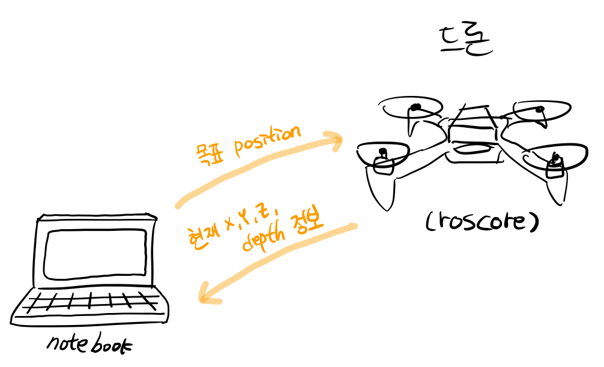
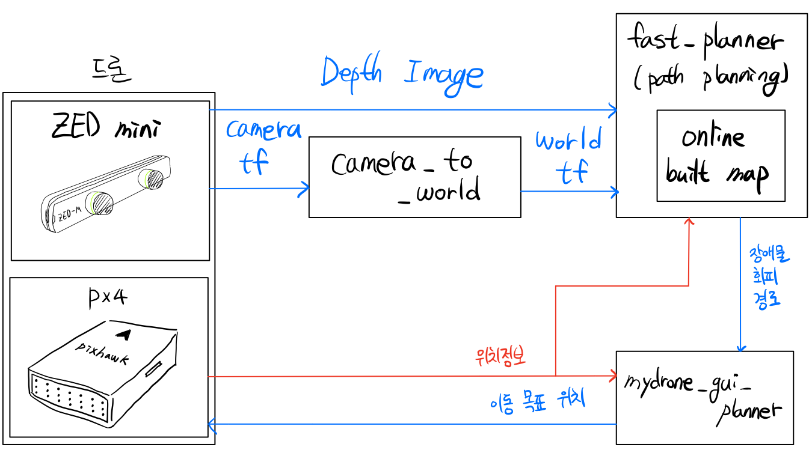

# mydrone_gui_planner_package


## 1. Summary

</img>

장애물 회피 경로를 만들어주는 [HKUST의 fast-planner](https://github.com/HKUST-Aerial-Robotics/Fast-Planner)를 실제 드론에 적용할 때 필요한 패키지들

1. camera_to_world : zed mini(depth camera) 좌표계를 fast-planner가 요구하는 좌표계로 맞춰서 publish 해주는 패키지
2. mydrone_gui_planner : fast-planner가 생성하는 궤도를 따라가도록 드론에게 명령을 전달하는 gui

## 2. Theory

● tf란?

좌표계(frame)을 추적할 수 있도록 도와주는 ros 라이브러리입니다.

tf로 두 좌표계 간의 좌표 변환도 가능하고 하나의 좌표계의 과거 이력도 확인할 수 있습니다.

ros topic과 비슷하게 항상 Ros 서버에 broadcast 되고 있어 언제 어떤 노드에서든지 tf를 받아 확인 할 수 있습니다.


## 3. Hardware structure



▲ 드론의 구성



▲ 전체 Ros 통신 구성

## 4. Code structure



### camera_to_world 패키지

1. zed camera 좌표계와 같은 형태의 tf를 만들어 broadcast. ( line 40 ~ 59 )

```c++
br.sendTransform(tf::StampedTransform(transform_base, ros::Time::now(), "world", "fp_base_link"));

//카메라 tf
tf::Transform transform_camera;

transform_camera.setOrigin( tf::Vector3(0.0, 0.0, 0.0) );

tf::Quaternion q_orig, q_rot, q_new;
q_orig = tf::Quaternion(0, 0, 0, 1);
double r=-1.570795;
double p=0;
double y=-1.570795;
q_rot.setRPY(r, p, y);

q_new = q_rot*q_orig;
q_new.normalize();

transform_camera.setRotation( q_new );
br.sendTransform(tf::StampedTransform(transform_camera, ros::Time::now(), "fp_base_link", "zedm_center_camera_optical_frame"));
//
```

2. 1의 tf를 "/world" tf로 변환 ( line 63 ~ 71 )

```c++
tf::StampedTransform transform;
try
{
	listener.lookupTransform("/world", "zedm_center_camera_optical_frame",
	ros::Time(0), transform);
}catch (tf::TransformException ex){
	ROS_WARN("%s",ex.what());
	ros::Duration(1.0).sleep();
	continue;
}
```

3. 2의 변환정보를 "ctw/tf_pub"(3D map 생성에 사용) 이름으로 topic publish ( line 73 ~ 86 )

```c++
geometry_msgs::PoseStamped camera_tf;
camera_tf.header.frame_id = "zedm_center_camera_optical_frame";

camera_tf.header.stamp = ros::Time::now();
camera_tf.pose.position.x = transform.getOrigin().x();
camera_tf.pose.position.y = transform.getOrigin().y();
camera_tf.pose.position.z = transform.getOrigin().z();

camera_tf.pose.orientation.x = transform.getRotation().x();
camera_tf.pose.orientation.y = transform.getRotation().y();
camera_tf.pose.orientation.z = transform.getRotation().z();
camera_tf.pose.orientation.w = transform.getRotation().w();

tf_pub.publish(camera_tf);
```

### mydrone_gui_planner 패키지
=> [mydrone_gui_keyboard](https://github.com/0307kwon/mydrone_gui_keyboard)의 구조와 유사  


## 5.How to use

1. catkin_ws/src 폴더로 진입
2. $ git clone https://github.com/0307kwon/mydrone_gui_planner_package.git
3. $ catkin_make

- 이후 실제 실험시에 (zed가 달려있는 실제 드론으로 실험)
4. (드론) mavros와 zed 패키지 실행 
5. (컴퓨터) $ rosrun camera_to_world camera_to_world
6. (컴퓨터) $ roslaunch plan_manage rviz.launch (hkust fast planner 패키지 필요)
7. (컴퓨터) plan_manage의 topo_replan.launch 수정
``` launch
<launch>
  <!-- global parameters -->
  <arg name="map_size_x" value="40.0"/>
  <arg name="map_size_y" value="20.0"/>
  <arg name="map_size_z" value=" 5.0"/>

  <arg name="odom_topic" value="/mavros/local_position/odom" />

  <!-- main algorithm params -->
  <include file="$(find plan_manage)/launch/topo_algorithm.xml">
    <!-- size of map -->
    <arg name="map_size_x_" value="$(arg map_size_x)"/>
    <arg name="map_size_y_" value="$(arg map_size_y)"/>
    <arg name="map_size_z_" value="$(arg map_size_z)"/>
    <arg name="odometry_topic" value="$(arg odom_topic)"/>

    <!-- camera pose: transform of camera frame in the world frame -->
    <!-- depth topic: depth image, 640x480 by default -->
    <!-- don't set cloud_topic if you already set these ones! -->
    <arg name="camera_pose_topic" value="/ctw/tf_pub"/>
    <arg name="depth_topic" value="/zedm/zed_node/depth/depth_registered"/>

    <!-- topic of point cloud measurement, such as from LIDAR  -->
    <!-- don't set camera pose and depth, if you already set this one! -->
    <arg name="cloud_topic" value="/pcl_render_node/cloud"/>

    <!-- intrinsic params of the depth camera -->
    <arg name="cx" value="321.04638671875"/>
    <arg name="cy" value="243.44969177246094"/>
    <arg name="fx" value="387.229248046875"/>
    <arg name="fy" value="387.229248046875"/>

    <!-- maximum velocity and acceleration the drone will reach -->
    <arg name="max_vel" value="1.0" />
    <arg name="max_acc" value="0.5" />

    <!-- 1: use 2D Nav Goal to select goal  -->
    <!-- 2: use global waypoints below  -->
    <arg name="flight_type" value="1" />

    <!-- global waypoints -->
    <arg name="point_num" value="2" />

    <arg name="point0_x" value="19.0" />
    <arg name="point0_y" value="0.0" />
    <arg name="point0_z" value="1.0" />

    <!-- set more waypoints if you need -->
    <arg name="point1_x" value="0.0" />
    <arg name="point1_y" value="10.0" />
    <arg name="point1_z" value="1.0" />

    <arg name="point2_x" value="-19.0" />
    <arg name="point2_y" value="0.0" />
    <arg name="point2_z" value="1.0" />
  </include>

  <!-- trajectory server -->
  <node pkg="plan_manage" name="traj_server" type="traj_server" output="screen">
    <remap from="/position_cmd" to="planning/pos_cmd"/>

    <remap from="/odom_world" to="$(arg odom_topic)"/>
    <param name="traj_server/time_forward" value="1.5" type="double"/>
  </node>

  <node pkg="waypoint_generator" name="waypoint_generator" type="waypoint_generator" output="screen">
    <remap from="~odom" to="$(arg odom_topic)"/>
    <remap from="~goal" to="/move_base_simple/goal"/>
    <remap from="~traj_start_trigger" to="/traj_start_trigger" />
    <param name="waypoint_type" value="manual-lonely-waypoint"/>
  </node>

  <!-- use simulator
  <include file="$(find plan_manage)/launch/simulator.xml">
    <arg name="map_size_x_" value="$(arg map_size_x)"/>
    <arg name="map_size_y_" value="$(arg map_size_y)"/>
    <arg name="map_size_z_" value="$(arg map_size_z)"/>
    <arg name="c_num" value="150"/>
    <arg name="p_num" value="50"/>

    <arg name="odometry_topic" value="$(arg odom_topic)" />
  </include>-->

</launch>
```
8. (컴퓨터) $ roslaunch plan_manage topo_replan.launch
9. (컴퓨터) $ rosrun mydrone_gui_planner mydrone_gui_planner

## 6. Caution

rviz의 map 생성이 안되는 문제가 있다면
zed의 depth 메세지와 mavros의 위치 메세지의 timestamp가 같은 

rviz의 map이 생성될 때가 있고 안될 때가 있다면
zed의 depth 메세지와 mavros의 위치 메세지의 timestamp가 같은 선 상에 있지 않아
생기는 문제일 수 있으니 확인.


